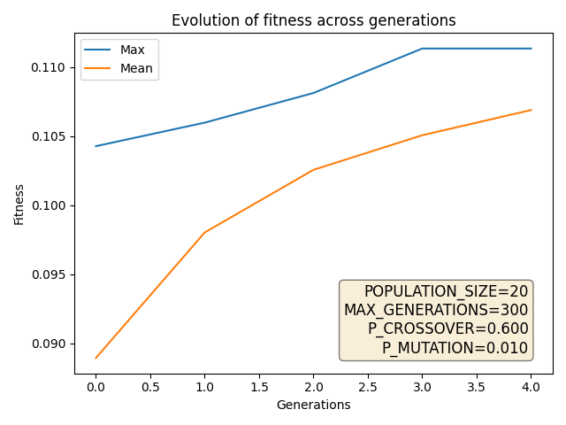
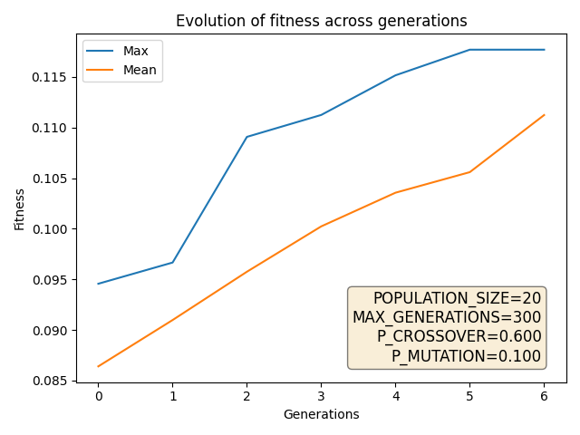
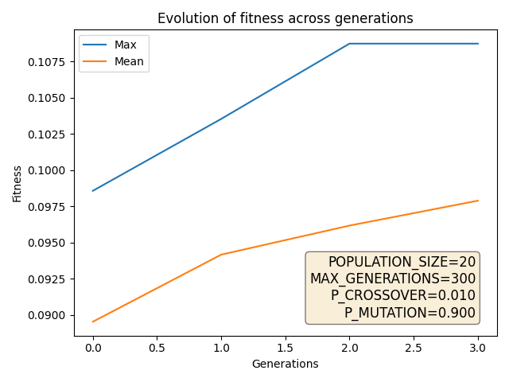
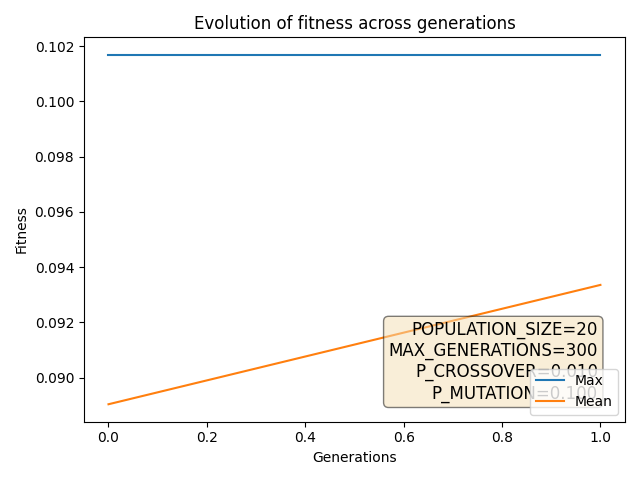
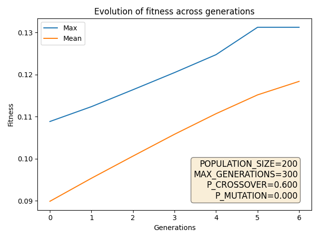
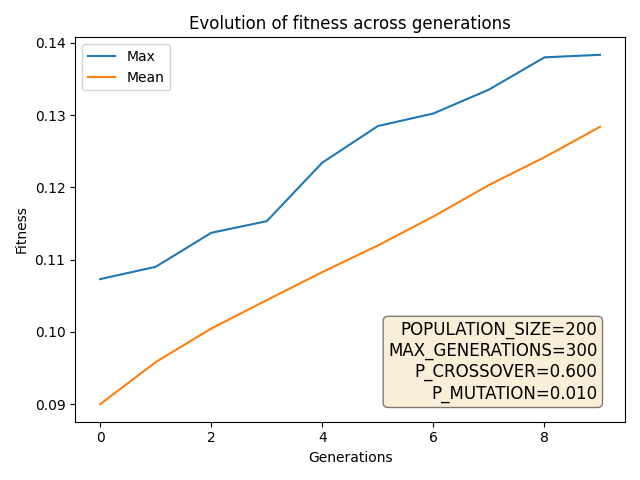
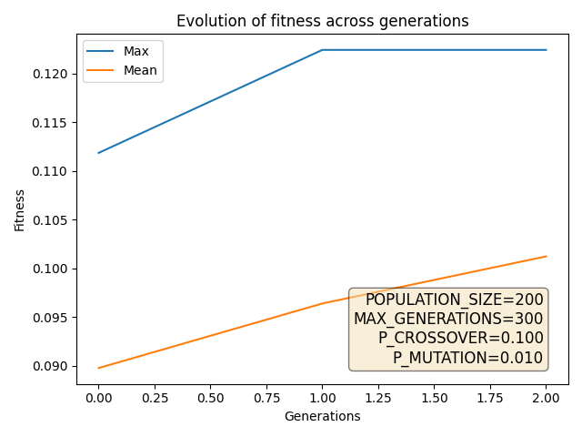
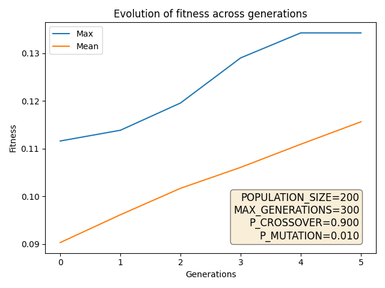
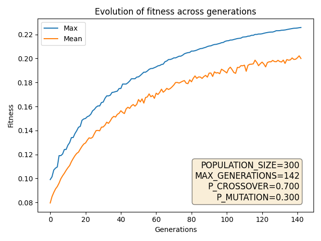

\newpage

\tableofcontents

\newpage

Το αποθετήριο του κώδικα στο Github βρίσκεται [εδώ](https://github.com/st1064870/genetic-algorithms-2020)

### Συμβολισμοί
* Μέγεθος πληθυσμού: $pop\_size$
* Πιθανότητα διασταύρωσης: $p_c$
* Πιθανότητα μετάλλαξης: $p_m$
* Συντελεστής συσχέτισης: $\rho$
* Μέση τιμή: $E[X]$, $\mu_x$

### Διευκρινίσεις
Σχετικά με την επιλογή χρήστη όπου αυτό απαιτείται θεωρούμε ότι είναι ο 90.

\newpage

### Β1. Σχεδιασμός ΓΑ
#### α) Κωδικοποίηση

*Να προτείνετε μια κωδικοποίηση για τα άτομα του πληθυσμού*

Το κάθε άτομο θα αποτελείται από μια λίστα (διάνυσμα) με 1682 ακέραιους που ανήκουν στο διάστημα [1, 5], δηλαδή με τις αξιολογήσεις του για κάθε ταινία .

#### β) Πλεονάζουσες τιμές

*Είναι πιθανό να προκύψουν πλεονάζουσες τιμές, για παράδειγμα, τιμές > 5 λόγω δυαδικής κωδικοποίησης. Περιγράψτε πώς θα αντιμετωπίσετε το πρόβλημα αυτό.*

Με την συγκεκριμένη κωδικοποίηση δεν είναι πιθανό να προκύψουν πλεονάζουσες τιμές και άρα δεν χρειάζεται να αντιμετωπίσουμε αυτό το πρόβλημα.

*Εξετάστε αν μπορείτε να αποφύγετε τις πλεονάζουσες τιμές, αναθεωρώντας την κωδικοποίηση που προτείνατε στο (α).*

Απαντήθηκε στο παραπάνω ερώτημα.

#### γ) Αρχικός πληθυσμός

*Περιγράψτε μια διαδικασία για τη δημιουργία αρχικού πληθυσμού ατόμων.*

Η διαδικασία που θα ακολουθήσουμε για τη δημιουργία του αρχικού πληθυσμού είναι η εξής. Επιλέγουμε έναν χρήστη (διάνυσμα γραμμή) από τον 943x1682 πίνακα του ml100k dataset ο οποίος θα είναι το άτομο. Αυτός θα έχει κάποιες κενές τιμές στις ταινίες που δεν έχει αξιολογήσει ο χρήστης. 

*Τι είδους αρχικές τιμές θα επιλέξετε για τις ταινίες που δεν έχει δει ο χρήστης; Μπορεί να αντιστοιχούν στο μέσο όρο, όπως στο μέρος Α;*

Για τη δημιουργία του πληθυσμού θα βασιστούμε στο διάνυσμα που επιλέξαμε παραπάνω και τις κενές τιμές θα τις γεμίσουμε με τυχαίες τιμές. 
Προφανώς δεν μπορούμε να τις γεμίσουμε με τον μέσο όρο των βαθμολογιών του χρήστη αφού ο αρχικός πληθυσμός θα αποτελούταν από ίδια άτομα, θα μπορούσαμε όμως να προσθέταμε σε αυτόν τον μέσω όρο ένα μικρό ποσό θορύβου ώστε να παίρναμε διαφορετικά άτομα. Ωστόσο πιστεύουμε πως ακόμα και μετά αυτό το τέχνασμα ο αρχικός υποχώρος στον οποίο θα ψάξουμε για λύσεις είναι αρκετά μικρός και πιθανότατα να συγκλίνει ο αλγόριθμος σε κάποιο τοπικό ελάχιστο.

*Τι θα συμβεί με τις τιμές για τις ταινίες που o χρήστης έχει δει; Θα τις συμπεριλάβετε στα γονίδια των ατόμων του πληθυσμού; Θα πρέπει να παραμένουν σταθερές;*

Τις τιμές για τις βαθμολογίες των ταινιών που έχει ήδη δει ο χρήστης θα τις συμπεριλάβουμε στα γονίδια των ατόμων του πληθυσμού, γιατί χρειάζονται στη συνάρτηση καταλληλότητας. Ωστόσο αυτές θα πρέπει να παραμένουν σταθερές.

#### δ) Διαδικασία επιδιόρθωσης

*Αν η κωδικοποίησή σας είναι πιθανό να δημιουργεί μη νόμιμες λύσεις, προδιαγράψτε μια διαδικασία χειρισμού των μη νόμιμων λύσεων, σχολιάζοντας και αξιολογώντας τις παρακάτω εναλλακτικές:*

Στη κωδικοποίηση μας μπορεί να προκύψουν μη νόμιμες λύσεις αφού στην κωδικοποίηση του ατόμου έχουμε συμπεριλάβει και τις βαθμολογίες ταινιών τις οποίες ο χρήστης έχει βαθμολογήσει οι οποίες δεν θέλουμε να αλλάξουν τιμή.

*Απόρριψη της μη νόμιμης λύσης από τον πληθυσμό και αντικατάστασής της από κάποιο άλλο άτομο (τυχαία ή με ελιτισμό).*

Η μέθοδος επιδιόρθωσης με τυχαίο άτομο (ανάλογα και το $p_m$) είναι πολύ αργή, διότι κάθε φορά πρέπει να βρεθεί τυχαία ένα άτομο το οποίο ενώ η μέθοδος αντικατάστασης με τον ελίτ της κάθε γενιάς περιορίζει πολύ τον χώρο εύρεσης λύσεων.

*Επιδιόρθωση: Διαδικασία επιδιόρθωσης (repair procedure) η οποία αντιστοιχίζει τη μη νόμιμη λύση σε μια νόμιμη, π.χ. αντικατάσταση κάθε φορά των γνωστών αξιολογήσεων με τις πραγματικές τιμές.*

Αυτή κρίναμε αρχικά και στη συνέχεια επιβεβαιώσαμε και πρακτικά πως είναι η καλύτερη λύση για την επιδιόρθωση. Έχει σταθερό χρόνο και μας εγγυάται σωστές απαντήσεις.

*Εφαρμογή ποινής: Μια μη νόμιμη λύση γίνεται αποδεκτή, αλλά της εφαρμόζεται ανάλογη ποινή από την συνάρτηση καταλληλότητας. Να περιγράψετε μια διαδικασία εφαρμογής ποινής για τέτοιες λύσεις.*

Ουσιαστικά το να εφαρμόσουμε τιμή από τη συνάρτηση καταλληλότητας σημαίνει να αυξήσουμε την "απόσταση" μεταξύ του ατόμου και της γειτονιάς του, δηλαδή να το απομακρύνουμε από τη γειτονιά του. Αυτό πιστεύουμε πως μπορούμε να το πετύχουμε με δύο τρόπους. Ο πρώτος είναι να βρούμε ένα "μέσο" διάνυσμα αντιπροσωπευτικό για τη γειτονιά του και να αφαιρέσουμε από το διάνυσμα του χρήστη, ένα ποσοστό του προϋπολογισθέντος μέσου αυτού διανύσματος. Ο δεύτερος είναι να αφαιρέσουμε από τον χρήστη ένα ποσοστό του διανύσματος του κάθε χρήστη που ανήκει στη γειτονιά του. Προφανώς όπου έχουμε ελλιπείς τιμές θα πρέπει να τις γεμίσουμε με τον μέσο όρο του διανύσματος.

#### ε) Εύρεση γειτονιάς χρήστη

*Υπολογίστε την απόσταση του χρήστη από όλους τους υπόλοιπους στο σύνολο εκπαίδευσης*

*βρείτε τους top-10 που είναι πιο κοντά (γειτονιά του χρήστη)*

*Να χρησιμοποιήσετε την μετρική Pearson και να σχολιάσετε την καταλληλότητά της, σε σχέση και με τις υπόλοιπες, για την αποφυγή της πόλωσης στις βαθμολογίες.*

Η μετρική Pearson χρησιμοποιείται συνήθως όταν οι τυχαίες μεταβλητές (στη περίπτωση μας τα διανύσματα των χρηστών) είναι σε διαφορετικές μονάδες μέτρησης ή κλίμακες και προσπαθούμε να βρούμε το συσχετισμό τους.

*να αιτιολογήσετε πώς θα αντιμετωπίσετε τις ελλιπείς τιμές, ειδικά για τον υπολογισμό της γειτονιάς*

Στον υπολογισμό της γειτονιάς γεμίσαμε τις ελλιπείς τιμές με την μέση τιμή του κάθε χρήστη αντίστοιχα.
Η επιλογή μας αυτή βασίζεται στο γεγονός ότι $$\rho = \tfrac{E[(x-\mu_x)(y-\mu_y)]}{\sigma_x\sigma_y}$$ και ότι ο παρανομαστής δεν μεταβάλλεται αν $x=\mu_x$ ή $y=\mu_y$ αντίστοιχα.

#### στ) Συνάρτηση καταλληλότητας

*Επειδή η τιμή του συντελεστή Pearson κινείται στο [-1, 1],εξετάστε αν χρειάζεται να κλιμακώστε κατάλληλα τη συνάρτηση καταλληλότητας, ώστε να παίρνει μόνο μη αρνητικές τιμές.*

Η συνάρτηση καταλληλότητας που βασίζεται στον συντελεστή pearson θα χρειαστεί κλιμάκωση μόνο σε περίπτωση που χρειαζόμαστε κάποια θετική συνάρτηση καταλληλότητας (π.χ. αν χρησιμοποιηθεί ρουλέτα στο στάδιο της επιλογής)

#### ζ) Γενετικοί τελεστές
*Nα προτείνετε τους τελεστές επιλογής, διασταύρωσης και μετάλλαξης που θα χρησιμοποιήσετε*

**Τελεστές**

* Επιλογής : Τουρνουά 3 ατόμων
* Διασταύρωσης : Ομοιόμορφη
* Μετάλλαξη : Ομοιόμορφη. Δηλαδή αντικατάσταση κάποιου γονιδίου ομοιόμορφα τυχαία με κάποιο άλλο μέσα από ένα διάστημα τιμών, το οποίο στη περίπτωση μας ήταν το ακέραιο διάστημα [0,5].

*Να αξιολογήσετε τη χρήση ρουλέτας με βάση το κόστος, με βάση την κατάταξη και τουρνουά*

Η χρήση ρουλέτας και των δύο ειδών στην επιλογή, μετά από πολλά πειράματα και παρά τις προσδοκίες μας, απέφερε τα χειρότερα αποτελέσματα από όλες τις δοκιμές που δοκιμάσαμε. Δεν υπήρξε σχεδόν καμία εμφανής σύγκλιση.

*Να αξιολογήσετε την καταλληλότητα των ακόλουθων τελεστών: Διασταύρωση μονού σημείου, διασταύρωση πολλαπλού σημείου, ομοιόμορφη διασταύρωση, OX και PMX*

Οι διασταυρώσεις μονού και πολλαπλού σημείου κρίθηκαν πολύ αργές και ο αλγόριθμος αργούσε να συγκλίνει. Πιο συγκεκριμένα χρειάστηκαν ως επί το πλείστον >300 γενιές και στις 2 περιπτώσεις για σύγκλιση ενώ και οι δύο σύγκλιναν σε τοπικό ελάχιστο μικρότερο αυτού που σύγκλινε η ομοιόμορφη διασταύρωση.

Οι διασταυρώσεις OX, PMX κρίθηκαν ακατάλληλες για τη φύση του προβλήματος μας καθώς έχουν εφαρμογή κυρίως σε προβλήματα όπου το ζητούμενο άτομο είναι μια μετάθεση των αρχικών ατόμων, όπως στο TSP πρόβλημα.

*Nα αξιολογήσετε τη χρήση ελιτισμού*

Η χρήση ελιτισμού κρίθηκε χρήσιμη για την επίλυση του προβλήματος μας στο να συγκλίνει πιο γρήγορα. Οι γενικότεροι κίνδυνοι που ελλοχεύουν με τη χρήση ελιτισμού (δηλαδή η σύγκλιση σε τοπικό ελάχιστο) δεν παρατηρήθηκαν.

\newpage

### B2. Υλοποίηση ΓΑ
*Να γράψετε ένα πρόγραμμα, σε οποιοδήποτε περιβάλλον ή γλώσσα προγραμματισμού, που να υλοποιεί τον γενετικό αλγόριθμο που σχεδιάσετε*

Ο κώδικας για τον γενετικό αλγόριθμο βρίσκεται στο αποθετήριο, πιο συγκεκριμένα κυρίως σε αυτό το αρχείο (πατήστε [εδώ](https://github.com/st1064870/genetic-algorithms-2020/blob/master/src/cf-ml100k.py)), ενώ πολλές συναρτήσεις δευτερεύουσας σημασίας έχουν υλοποιηθεί σε αυτό (πατήστε [εδώ](https://github.com/st1064870/genetic-algorithms-2020/blob/master/src/helpers.py)).

### Β3. Αξιολόγηση και Επίδραση Παραμέτρων
#### α)
*Να τρέξετε τον αλγόριθμο για τις τιμές των παραμέτρων που φαίνονται στον παρακάτω πίνακα και να τον συμπληρώσετε.*

| Α/Α | ΜΕΓΕΘΟΣ ΠΛΗΘΥΣΜΟΥ | ΠΙΘΑΝΟΤΗΤΑ ΔΙΑΣΤΑΥΡΩΣΗΣ | ΠΙΘΑΝΟΤΗΤΑ ΜΕΤΑΛΛΑΞΗΣ | ΜΕΣΗ ΤΙΜΗ ΒΕΛΤΙΣΤΟΥ | ΜΕΣΟΣ ΑΡΙΘΜΟΣ ΓΕΝΕΩΝ |
|---|-----|-----|------|---|---|
| 1 | 20  | 0.6 | 0.00 | 0.1067 | 3.0 |
| 2 | 20  | 0.6 | 0.01 | 0.1074 | 2.9 |
| 3 | 20  | 0.6 | 0.10 | 0.1080 | 3.0 |
| 4 | 20  | 0.9 | 0.01 | 0.1072 | 3.3 |
| 5 | 20  | 0.1 | 0.01 | 0.1014 | 2.2 |
| 6 | 200 | 0.6 | 0.00 | 0.1223 | 5.2 |
| 7 | 200 | 0.6 | 0.01 | 0.1222 | 4.8 |
| 8 | 200 | 0.1 | 0.01 | 0.1112 | 2.8 |
| 9 | 200 | 0.9 | 0.01 | 0.1225 | 4.5 |

#### β)
*Για κάθε περίπτωση του παραπάνω πίνακα να σχεδιάστε την καμπύλη εξέλιξης (απόδοση/αριθμό γενιών) της καλύτερης λύσης (της μέσης τιμής αυτής, σε κάθε τρέξιμο).*

#### γ)
*να διατυπώσετε αναλυτικά τα συμπεράσματά σας σχετικά με την επίδραση της κάθε παραμέτρου (μέγεθος πληθυσμού, πιθανότητα διασταύρωσης, πιθανότητα μετάλλαξης) στη σύγκλιση του αλγορίθμου.*

Αρχικά παρατηρούμε ότι ο αλγόριθμος εκτελείται για πολύ λίγους αριθμούς γενεών και δεν προλαβαίνει όχι μόνο να συγκλίνει σε κάποιο τοπικό μέγιστο αλλά σε ορισμένες εκτελέσεις ούτε καν να "ξεκινήσει". Αυτό οφείλεται στο ότι το κριτήριο τερματισμού μη βελτίωσης της καλύτερης λύσης πάνω από 1% σε σχέση με τη προηγούμενη γενιά που ζητάει η εκφώνηση(το οποίο είναι και ο λόγος για τον οποίο τερματίζεται κάθε εκτέλεση), είναι πολύ αυστηρό για τον αλγόριθμο μας. Οπότε οι αιτιολογήσεις λαμβάνουν υπόψιν και άλλα πειράματα που έγιναν με τον αλγόριθμο για περισσότερες γενιές.

* Μέγεθος πληθυσμού $pop\_size$: Είναι από τους σημαντικότερους παράγοντες στην εύρεση της κατάλληλης λύσης του προβλήματος. Ο αλγόριθμος μπορεί να συγκλίνει σε λάθος τιμή καθώς όταν όταν το μέγεθος του πληθυσμού είναι μικρό μειώνεται και ο χώρος αναζήτησης των λύσεων και άρα και η βέλτιστη λύση.
* Πιθανότητα διασταύρωσης $\rho_c$: Είναι από τους σημαντικότερους παράγοντες στην εύρεση της κατάλληλης λύσης του προβλήματος. Όπου έχουμε πολύ μικρό $\rho_c$ (π.χ. 0.01) ο αλγόριθμος αργεί υπερβολικά να συγκλίνει.
* Πιθανότητα μετάλλαξης $\rho_m$: Η πιθανότητα μετάλλαξης είναι κυρίως για να μην συγκλίνει ο αλγόριθμος σε τοπικά ελάχιστα. Στο συγκεκριμένο πρόβλημα και σύμφωνα με τις παρατηρήσεις μας δεν αντιληφθήκαμε να εγκλωβίζεται ο αλγόριθμος σε τοπικά ελάχιστα, οπότε η συμβολή του στην σύγκλιση ήταν μικρή.

\newpage

### Β4. Αξιολόγηση Συστάσεων
#### β)
*να αναφέρετε RMSE και ΜΑΕ για τις 10 αξιολογήσεις που περιέχονται στο σύνολο ελέγχου, για έναν χρήστη της επιλογής σας, δίνοντας τις αντίστοιχες γραφικές παραστάσεις ανά γενιά*

RMSE = 1.8166
MAE = 1.3000

*αντίστοιχες γραφικές παραστάσεις ανά γενιά*

\newpage

### Ενδεικτική Βιβλιογραφία

[1] M. Srinivas and L. M. Patnaik, “Genetic algorithms: a survey,” Computer, vol. 27, no. 6, pp. 17–26, Jun. 1994.

[2] A. Hussain, Y. S. Muhammad, M. Nauman Sajid, I. Hussain, A. Mohamd Shoukry, and S. Gani, “Genetic Algorithm for Traveling Salesman Problem with Modified Cycle Crossover Operator,” Computational Intelligence and Neuroscience, vol. 2017, pp. 1–7, 2017.

